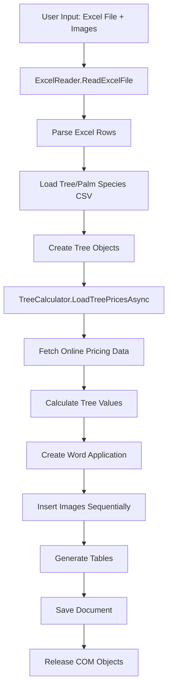

# Performance Analysis Report: C# Windows Forms Tree Report Generator

## Executive Summary

This analysis examines a C# Windows Forms application that reads Excel files containing tree data and generates Word documents with reports and images. The application shows significant performance bottlenecks with large Excel files due to memory management issues, synchronous I/O operations, and inefficient data processing patterns.

## Current Architecture Overview

### Application Structure
```
WindowsFormsApp1/
├── ReportGeneratorForm.cs          # Main UI and orchestration
├── ExcelReader/
│   └── ExcelReader.cs             # Excel file processing
├── Models/
│   ├── Tree.cs                    # Core tree data model
│   ├── TreeCalculator.cs          # Price calculation logic
│   ├── TreeSpecie.cs             # Tree species metadata
│   ├── PalmSpecie.cs             # Palm tree metadata
│   └── TreeEvaluation.cs         # Evaluation constants
└── TreeCalculator/
    └── StaticHtmlFile.html        # Fallback pricing data
```

### Data Flow Architecture



## Critical Performance Bottlenecks

### 1. Excel Reading Implementation (ExcelReader.cs)

#### Issues Identified:

**Memory Inefficiency:**
- **Line 31**: `rows?.Count()` performs full enumeration to get count
- **Line 38**: Pre-allocates `List<Tree>(numberOfTrees)` but `numberOfTrees` includes header row
- **Lines 41-50**: Sequential row processing without streaming
- **Lines 124-189**: Cell-by-cell processing with multiple string operations per cell

**Performance Impact:** For large Excel files (>1000 rows), this approach loads the entire dataset into memory and performs expensive enumeration operations.

**Code Analysis:**
```csharp
// BOTTLENECK: Full enumeration just to get count
IEnumerable<Row> rows = sheetData.Elements<Row>();
int numberOfTrees = rows?.Count() ?? 0;  // Expensive operation

// BOTTLENECK: Sequential processing without streaming
foreach (Row r in rows.Skip(1))
{
    // Cell-by-cell string processing
    foreach (Cell cell in row.Elements<Cell>())
    {
        string cellValue = GetCellValue(cell, sharedString).Trim(); // String allocation
        var columneName = GetColumnName(cell.CellReference.Value); // More string operations
    }
}
```

### 2. Memory Management Issues (ReportGeneratorForm.cs)

#### Critical COM Object Leaks:

**Lines 135-136**: Incomplete COM object cleanup
```csharp
System.Runtime.InteropServices.Marshal.ReleaseComObject(doc);
System.Runtime.InteropServices.Marshal.ReleaseComObject(wordApp);
// MISSING: Range, Table, Cell, Row objects not released
```

**Lines 177-180**: Partial COM cleanup in image processing
```csharp
// Only releases some objects, not all created COM objects
System.Runtime.InteropServices.Marshal.ReleaseComObject(inlineShape);
System.Runtime.InteropServices.Marshal.ReleaseComObject(range);
System.Runtime.InteropServices.Marshal.ReleaseComObject(paragraph);
// MISSING: imageNameParagraph, imageNameRange not released
```

**Performance Impact:** Memory leaks accumulate with each document generation, especially problematic with large image sets.

### 3. Synchronous I/O Operations

#### Image Processing Bottleneck (Lines 149-184):
```csharp
foreach (string imagePath in imagePaths)
{
    // BOTTLENECK: Synchronous image loading and Word insertion
    InlineShape inlineShape = doc.InlineShapes.AddPicture(imagePath, Range: range);
    inlineShape.Width = 300;
    inlineShape.Height = 200;
}
```

**Issues:**
- Sequential image processing blocks UI thread
- No progress feedback for large image sets
- Synchronous Word automation calls

#### Network Operations (TreeCalculator.cs Lines 91-131):
```csharp
public async Task<Dictionary<string, double>> FetchTreePricesAsync()
{
    // Network call but fallback is synchronous file I/O
    string htmlContent = await DownloadHtmlAsync(url);
    // BOTTLENECK: Synchronous file fallback
    string htmlContent = File.ReadAllText(absoluteFilePath);
}
```

### 4. Inefficient Data Structures and Algorithms

#### Species Lookup Performance (ExcelReader.cs Lines 205-226):
```csharp
private static bool TryGetSpecies(Dictionary<string, TreeSpecie> treesSpecies, string inputSpecies, out TreeSpecie inferredSpecies)
{
    // BOTTLENECK: Linear search through all keys for fuzzy matching
    string rightKey = treesSpecies.Keys.FirstOrDefault(key => 
        key.Trim().Replace("-", "").Replace(" ", "") == cleanedInputValue);
}
```

**Performance Impact:** O(n) lookup for each tree when fuzzy matching is needed.

#### Table Generation Inefficiency (ReportGeneratorForm.cs):
```csharp
// BOTTLENECK: Multiple passes over the same data
foreach (var tree in trees)  // Pass 1: Calculate prices
{
    tree.PriceInNis = _treeCalculator.TryToGetTreePrice(tree) ?? tree.PriceInNis;
}

// Later: Pass 2, 3, 4 for different tables
AddFirstTable(doc, trees);
AddSecondTable(doc, trees);
AddThirdTable(doc, trees);
```

### 5. Word Automation Performance Issues

#### Table Creation Bottlenecks:
```csharp
// BOTTLENECK: Individual cell updates instead of bulk operations
newRow.Cells[15].Range.Text = tree.Index.ToString();
newRow.Cells[14].Range.Text = tree.Species;
// ... 15 individual cell updates per row
```

**Performance Impact:** Each cell update triggers Word recalculation and formatting.

## Detailed Technical Analysis

### Memory Usage Patterns

1. **Excel Reading**: Loads entire workbook into memory via OpenXML
2. **Tree Objects**: Each tree creates multiple string properties (duplicated data)
3. **COM Objects**: Word automation creates numerous unreleased objects
4. **Image Processing**: Images loaded into memory without streaming

### I/O Operation Analysis

1. **Excel Reading**: Single-threaded, synchronous
2. **CSV Loading**: Synchronous file I/O for species data
3. **Image Processing**: Sequential, blocking operations
4. **Word Generation**: Synchronous COM automation
5. **Network Operations**: Async but with synchronous fallback

### CPU Utilization Issues

1. **Single-threaded Processing**: No parallel processing for independent operations
2. **String Operations**: Excessive string manipulation in Excel parsing
3. **Linear Searches**: O(n) species lookups
4. **Word Automation**: COM calls are inherently slow

## Performance Impact Assessment

### Scalability Limits

| Excel File Size | Estimated Performance Impact |
|----------------|------------------------------|
| 100 rows | Acceptable (< 30 seconds) |
| 500 rows | Noticeable delay (1-2 minutes) |
| 1000+ rows | Poor performance (3+ minutes) |
| 5000+ rows | Likely failure (memory issues) |

### Resource Consumption

- **Memory**: Linear growth with file size + COM object accumulation
- **CPU**: Single-core utilization during processing
- **Disk I/O**: Multiple file system accesses
- **Network**: Potential timeouts for price fetching

## Optimization Opportunities (Prioritized)

### High Impact Optimizations

1. **Streaming Excel Processing**
   - Use SAX-style parsing instead of loading entire document
   - Process rows incrementally
   - Implement lazy evaluation

2. **COM Object Management**
   - Implement comprehensive COM cleanup
   - Use `using` statements where possible
   - Consider alternative Word generation (OpenXML)

3. **Asynchronous Operations**
   - Async image processing with progress reporting
   - Parallel tree price calculations
   - Background Excel processing

### Medium Impact Optimizations

4. **Data Structure Improvements**
   - Pre-build normalized species lookup dictionaries
   - Use more efficient string matching (Trie structures)
   - Cache calculated values

5. **Memory Optimization**
   - Implement object pooling for Tree instances
   - Use StringBuilder for string concatenation
   - Streaming image processing

6. **Word Generation Optimization**
   - Bulk table operations
   - Reduce COM automation calls
   - Consider OpenXML SDK for document generation

### Low Impact Optimizations

7. **UI Responsiveness**
   - Progress reporting
   - Cancellation support
   - Background threading for long operations

## Architectural Recommendations

### Immediate Actions (Highest ROI)

1. **Fix COM Memory Leaks**: Implement comprehensive cleanup
2. **Add Progress Reporting**: Improve user experience
3. **Optimize Species Lookup**: Pre-process and normalize lookup data

### Short-term Improvements

1. **Async/Await Pattern**: Convert synchronous operations
2. **Streaming Processing**: Implement incremental Excel reading
3. **Error Handling**: Add robust exception handling

### Long-term Architectural Changes

1. **Separation of Concerns**: Split processing from UI
2. **Alternative Document Generation**: Consider OpenXML SDK
3. **Caching Layer**: Implement intelligent caching for repeated operations
4. **Plugin Architecture**: Modular design for extensibility

## Code Quality Issues

### Maintainability Concerns

- Magic numbers in table cell indexing
- Hardcoded Hebrew strings
- Mixed async/sync patterns
- Insufficient error handling
- Lack of logging for debugging

### Security Considerations

- No input validation for file paths
- Potential XML External Entity (XXE) vulnerabilities in Excel processing
- No sanitization of user inputs

## Conclusion

The application suffers from fundamental architectural issues that compound with file size. The primary bottlenecks are:

1. **Memory management** (COM objects and Excel loading)
2. **Synchronous I/O operations** (blocking UI and sequential processing)
3. **Inefficient algorithms** (linear searches and multiple data passes)

Addressing these issues through the recommended optimizations would significantly improve performance, especially for large Excel files. The highest priority should be fixing COM memory leaks and implementing asynchronous operations to maintain UI responsiveness.

## Performance Optimization Roadmap

```mermaid
gantt
    title Performance Optimization Timeline
    dateFormat  YYYY-MM-DD
    section Critical Fixes
    COM Memory Leaks     :critical, com, 2024-01-01, 3d
    Progress Reporting   :progress, 2024-01-02, 2d
    section Core Improvements
    Async Operations     :async, after progress, 5d
    Streaming Excel      :stream, after async, 4d
    section Advanced Optimizations
    Data Structures      :data, after stream, 3d
    Word Generation      :word, after data, 4d
```

This analysis provides the foundation for systematic performance improvements that will transform the application from a synchronous, memory-intensive process to an efficient, scalable solution.