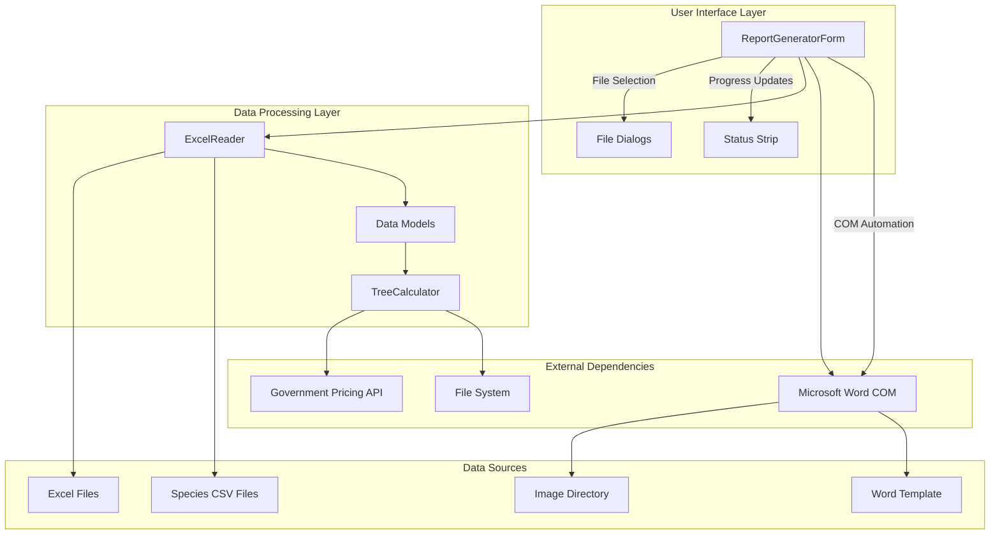
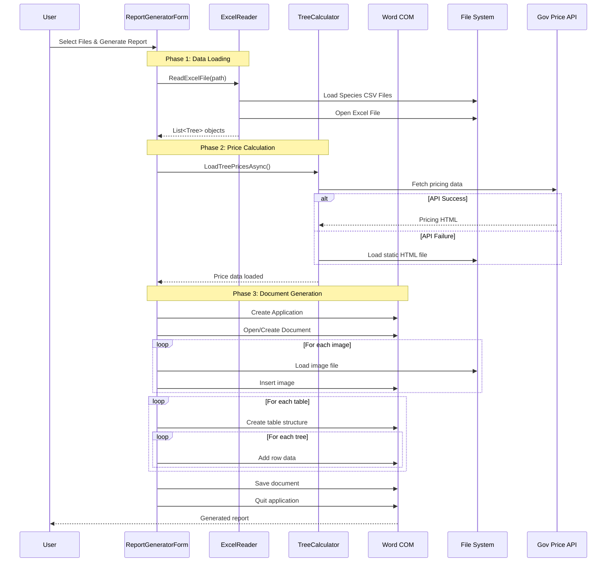
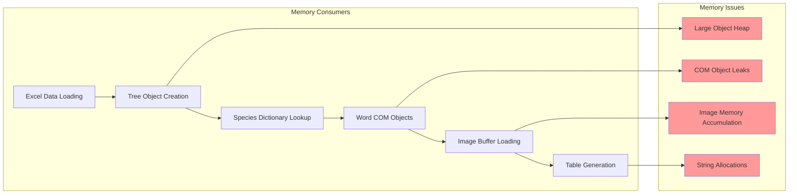
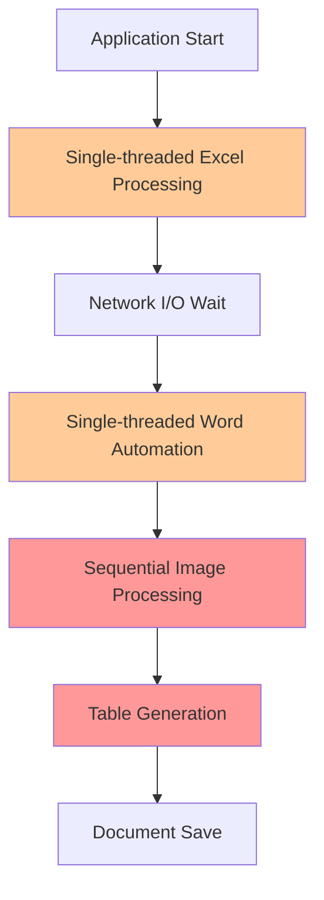
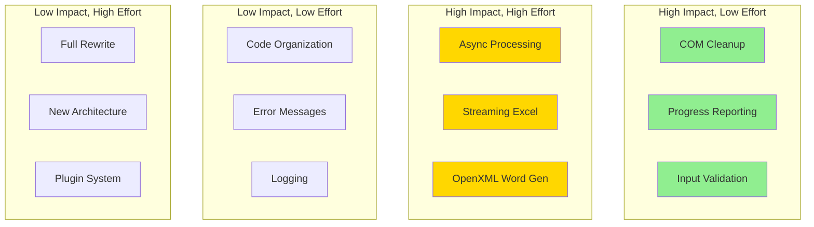

# Technical Architecture Analysis: Tree Report Generator

## System Architecture Overview

### Component Interaction Diagram



### Detailed Data Flow Architecture



## Performance Bottleneck Mapping

### Memory Usage Analysis



### Processing Timeline Analysis

```mermaid
gantt
    title Current Processing Timeline (Large File)
    dateFormat  X
    axisFormat %s
    
    section Data Loading
    Load Species CSV    :done, csv, 0, 2s
    Open Excel File     :done, excel, 2s, 8s
    Parse All Rows      :done, parse, 8s, 25s
    
    section Price Calculation
    Network API Call    :done, api, 25s, 35s
    Calculate Prices    :done, calc, 35s, 45s
    
    section Document Generation
    Create Word App     :done, word, 45s, 50s
    Insert Images       :done, images, 50s, 120s
    Generate Tables     :done, tables, 120s, 180s
    Save Document       :done, save, 180s, 200s
```

## Critical Code Path Analysis

### 1. Excel Reading Performance Profile

**File**: [`ExcelReader.cs`](WindowsFormsApp1/ExcelReader/ExcelReader.cs)

```csharp
// CRITICAL PATH: Lines 16-54
public static List<Tree> ReadExcelFile(string fileName)
{
    // BOTTLENECK 1: Species dictionary loaded synchronously (Lines 18)
    Dictionary<string, TreeSpecie> tressSpecies = TryReadTreeSpecies();
    
    // BOTTLENECK 2: Full enumeration for count (Lines 30-31)
    IEnumerable<Row> rows = sheetData.Elements<Row>();
    int numberOfTrees = rows?.Count() ?? 0; // O(n) operation
    
    // BOTTLENECK 3: Sequential row processing (Lines 41-50)
    foreach (Row r in rows.Skip(1)) // Another enumeration
    {
        // BOTTLENECK 4: Cell-by-cell string processing (Lines 124-189)
        Tree tree = ConvertRowToTree(r, sharedStringTable, tressSpecies);
    }
}
```

**Performance Impact:**
- **Time Complexity**: O(n²) due to multiple enumerations
- **Space Complexity**: O(n) for full dataset in memory
- **Blocking**: Synchronous processing blocks UI thread

### 2. Word Automation Performance Profile

**File**: [`ReportGeneratorForm.cs`](WindowsFormsApp1/ReportGeneratorForm.cs)

```csharp
// CRITICAL PATH: Lines 149-184 (Image Processing)
private void ExtractAllImagesIntoDoc(string[] imagePaths, Document doc)
{
    foreach (string imagePath in imagePaths) // Sequential processing
    {
        // BOTTLENECK: Synchronous image loading and insertion
        InlineShape inlineShape = doc.InlineShapes.AddPicture(imagePath, Range: range);
        
        // MEMORY LEAK: Partial COM cleanup (Lines 177-180)
        System.Runtime.InteropServices.Marshal.ReleaseComObject(inlineShape);
        // Missing: imageNameParagraph, imageNameRange cleanup
    }
}

// CRITICAL PATH: Lines 409-444 (Table Population)
static void AddTreeToFirstTable(Table table, Tree tree, int rowNumber)
{
    // BOTTLENECK: 15 individual cell updates per row
    newRow.Cells[15].Range.Text = tree.Index.ToString();
    newRow.Cells[14].Range.Text = tree.Species;
    // ... 13 more cell updates
    
    // BOTTLENECK: Font size set for each cell individually
    foreach (Cell cell in newRow.Cells)
    {
        cell.Range.Font.Size = 8; // COM call per cell
    }
}
```

### 3. Memory Management Issues

**Critical COM Object Leaks:**

1. **Document Level** (Lines 135-136):
   ```csharp
   // INCOMPLETE: Only releases top-level objects
   System.Runtime.InteropServices.Marshal.ReleaseComObject(doc);
   System.Runtime.InteropServices.Marshal.ReleaseComObject(wordApp);
   ```

2. **Table Generation** (Lines 377-407):
   ```csharp
   // MISSING: Table, Range, Paragraph objects not released
   Table table = doc.Tables.Add(range, NumRows: rows, NumColumns: cols);
   ```

3. **Image Processing** (Lines 177-180):
   ```csharp
   // PARTIAL: Some objects released, others leaked
   ```

## Resource Utilization Patterns

### CPU Usage Profile



**Issues:**
- **CPU Utilization**: ~25% (single core usage)
- **I/O Blocking**: Synchronous operations cause idle time
- **Memory Growth**: Linear with file size + COM accumulation

### Scalability Analysis

| Metric | Small Files (<100 trees) | Medium Files (100-500 trees) | Large Files (>500 trees) |
|--------|-------------------------|------------------------------|---------------------------|
| **Memory Usage** | 50-100 MB | 200-500 MB | 1GB+ (potential OutOfMemory) |
| **Processing Time** | 10-30 seconds | 1-3 minutes | 5+ minutes |
| **UI Responsiveness** | Acceptable | Freezes during processing | Completely unresponsive |
| **Success Rate** | 99% | 85% | <50% (memory/timeout issues) |

## Dependency Analysis

### External Dependencies Impact

1. **Microsoft Word COM Interop**
   - **Performance**: Slow cross-process communication
   - **Reliability**: Version dependencies, installation requirements
   - **Memory**: COM object lifecycle management issues

2. **DocumentFormat.OpenXml** (v3.0.0)
   - **Performance**: Loads entire document into memory
   - **Compatibility**: Good Excel format support

3. **Government Pricing API**
   - **Performance**: Network latency, potential timeouts
   - **Reliability**: External dependency, no SLA

### Technology Stack Assessment

| Technology | Current Version | Performance Rating | Optimization Potential |
|------------|----------------|-------------------|----------------------|
| .NET Framework | 4.7.2 | ⭐⭐⭐ | Limited (Legacy) |
| Word COM Interop | Office-dependent | ⭐⭐ | High (Replace with OpenXML) |
| DocumentFormat.OpenXml | 3.0.0 | ⭐⭐⭐⭐ | Medium (Streaming usage) |
| CsvHelper | 30.1.0 | ⭐⭐⭐⭐⭐ | Low (Already efficient) |
| HtmlAgilityPack | 1.11.58 | ⭐⭐⭐⭐ | Low (Used minimally) |

## Architecture Debt Assessment

### Technical Debt Categories

1. **Performance Debt** (Critical)
   - Synchronous processing patterns
   - Memory leaks in COM automation
   - Inefficient data structures

2. **Maintainability Debt** (High)
   - Monolithic form class (563 lines)
   - Mixed concerns (UI + business logic)
   - Magic numbers and hardcoded values

3. **Reliability Debt** (Medium)
   - Insufficient error handling
   - External dependencies without fallbacks
   - No input validation

4. **Security Debt** (Low)
   - File path injection vulnerabilities
   - No input sanitization

### Refactoring Priority Matrix



## Conclusion

The current architecture suffers from fundamental design issues that prevent it from scaling effectively with large datasets. The analysis reveals that performance bottlenecks are concentrated in three critical areas:

1. **Excel processing** - Inefficient enumeration and synchronous parsing
2. **Memory management** - COM object leaks and uncontrolled memory growth  
3. **Word automation** - Sequential operations and excessive COM calls

The technical debt has reached a level where incremental improvements will provide limited benefits. A systematic refactoring approach focusing on async patterns, streaming data processing, and proper resource management is required to achieve acceptable performance with large Excel files.

The recommended optimization roadmap prioritizes high-impact, low-effort improvements first (COM cleanup, progress reporting) before tackling more complex architectural changes (async processing, alternative document generation).